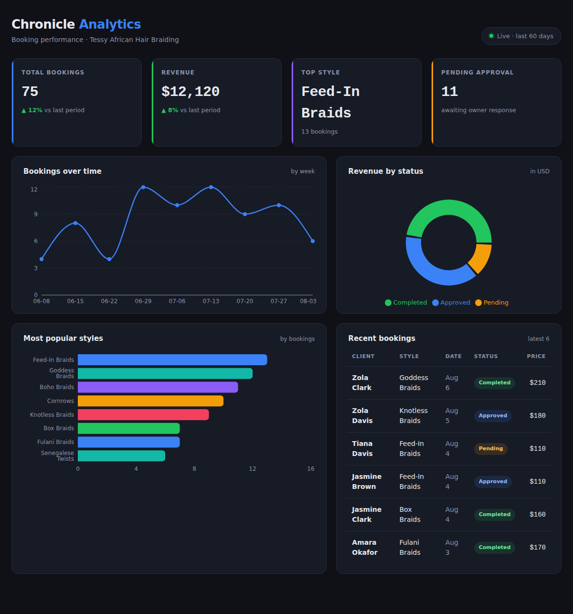

# Booking Analytics Dashboard

A React dashboard that turns a salon's raw bookings into a clear business picture — revenue, trends, most-popular styles, and pending approvals — at a glance.

Built as the analytics layer for the booking sites at [Chronicle Web](https://github.com/brightvictor-lab). First of three React portfolio projects.

**🔗 Live demo:https://braidbookapp.netlify.app/

---

## Screenshots



---

## Features

- **Four key metrics** — total bookings, revenue, top style, and pending approvals
- **Bookings-over-time** line chart (weekly trend)
- **Most-popular-styles** bar chart
- **Revenue-by-status** donut chart
- **Recent bookings** table with status pills
- Fully responsive, dark theme with a blue accent

---

## Tech Stack

- **React 18** (components, props)
- **Vite** — fast dev server and build tool
- **Recharts** — data visualisation
- Plain CSS with a small design-token system

> Sample data lives in `src/data/bookings.js`. In production this would be replaced by live data from Supabase.

---

## Running locally

```bash
npm install     # install dependencies (first time only)
npm run dev     # start the dev server, then open the printed localhost link
```

To build for production: `npm run build`

---

## About

Built by **Victor Bright** — Chronicle Web.
